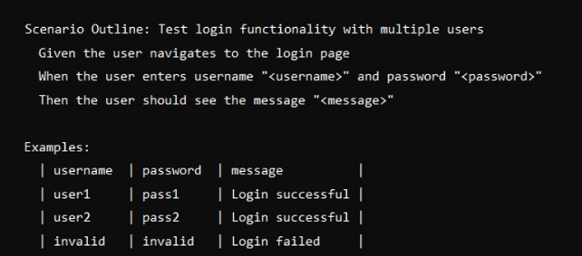

## Cucumber Interview Questions

### 1. What is Cucumber BDD?
Cucumber is an open source tool that supports BDD. It allows us to write test cases using plain english like syntax called as Gherkins.
These tests known as scenarios are easy to understand for both technical and non-technical people. The goal of Cucumber is to help communication between developers, testers and Business Analyst.

Example-
Feature: Login Functionality
   Scenario: Valid Login
   Given user is on login page
   When user enters valid credentials
   Then user should be redirected to home page

Benefits-
1. Improved Collaboration - Cucumber improves collaboration across teams by using a common syntax(Gherkins)
2. Documentation - Cucumber scenarios are also documentation.
3. Automation integration - Cucumber integrates with automation tools like selenium, cypress.

### 2. What are feature files, step definitions and gherkin syntax?
Feature Files - Feature files are plain text files written using Gherkins syntax, inside which we write scenarios.
Every scenario inside the file describes the functionality of the application.

Step Definitions - Step definitions are the code implementations of the steps defined in the gherkins scenario. Each gherkins steps(Given,When ,Then) is linked to a corresponding code block in the step definition.


### 3. What are cucumber tags?
Cucumber tags are used to organize and selectively run test. Tags are added to scenario or feature file level using @ followed by name.
For ex you can choose certain scenarios to run for smoke test and mark them using @SmokeTest.
mvn test -DCucumber.options="--tags @SmokeTest"

### 4. Folder Structure?


### 5. Cucumber BDD with TestNG?


### 6. What is the role of testNG and runner class in cucumber with testNG?
The testng.xml file and runner class have roles in executing cucumber test in cucumber with testNG framework.
1. testng.xml file -> This configuration file tells testNG to organize and execute test. It specifies which class to run and allows for group, sequence of execution and supports parallel execution.

2. runner class -> The runner class executes the cucumber tests.The runner class extends AbstractTestNGCucumberTests. In this class we define location of feature and step definitions.

### 7. How to run cucumber test in parallel using TestNG?

1. Run Scenarios in Parallel -> To run individual scenarios in parallel, we need to configure our runner class to enable parallel execution.
This is done by overridding the scenarios method in the runner class. 

```java
public class TestNGCucumberRunner extends AbstractTestNGCucumberTests {
    @Override
    @DataProvider(parallel = true)
    public Object[][] scenarios() {
        return super.scenarios();
    }
}
```

2. Parallel execution in testNG.xml -> TestNG allows to run test in parallel by adding a parallel attribute in the suite tag of testng.xml.

```java
<suite name="Test Suite" parallel="classes">
    <test name="TestChrome">
        <parameter name="browser" value="chrome" />
        <parameter name="env" value="uat" />
          <classes>
            <class name="runner.TestRunner"></class>
         </classes>
    </test> <!-- Test -->
```

### 8. How to implement data driven testing in Cucumber using Scenario Outline?
DataDriven testing is achieved using Scenario Outline and Examples Keyword. Scenario Outline allows to run a single scenario multiple times with different set of data.
We provide the placeholders in scenario and during execution cucumber will replace placeholders values from Examples.



### 9. What are Hooks in Cucumber?
Hooks allows you run blocks of code before and after scenarios.They setup precondition and clean up after test execution.

@Before

@After

### 10. What is background in Cucumber?
Background is a step that is executed before each scenario and is common all the scenarios.

### 11. What are Data Tables in Cucumber?
Datatables are used to pass list of values to cucumber step definitions.

```java
    @And("user select drop down value with$")
    public void userSelectDropDownValueWith(DataTable datatable) throws Exception {
        List<Map<String, String>> ffElements = datatable.asMaps(String.class, String.class);
        for(Map<String, String> ffElement : ffElements){
            selectDropDownPage.selectDropDownValue(ffElement.get("value"));
        }
    }
```


