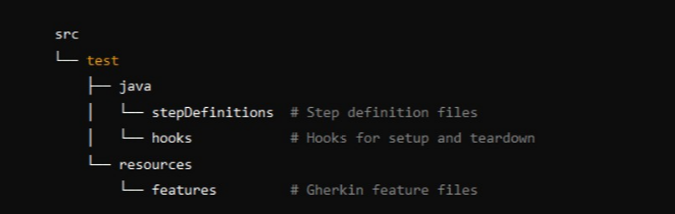
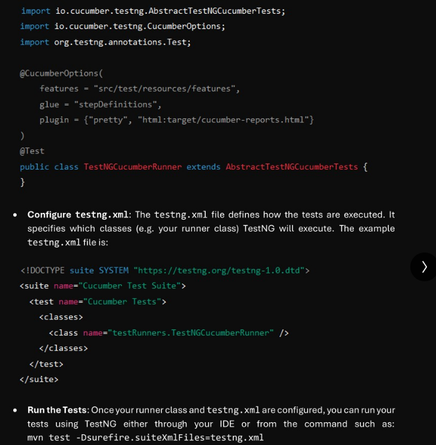

## Cucumber Interview Questions

### 1. What is Cucumber BDD?
Cucumber is an open source tool that supports BDD. It allows us to write test cases using plain english like syntax called as Gherkins.
These tests known as scenarios are easy to understand for both technical and non-technical people. The goal of Cucumber is to help communication between developers, testers and Business Analyst.

Example-
Feature: Login Functionality
   Scenario: Valid Login
   Given user is on login page
   When user enters valid credentials
   Then user should be redirected to home page

Benefits-
1. Improved Collaboration - Cucumber improves collaboration across teams by using a common syntax(Gherkins)
2. Documentation - Cucumber scenarios are also documentation.
3. Automation integration - Cucumber integrates with automation tools like selenium, cypress.

### 2. What are feature files, step definitions and gherkin syntax?
Feature Files - Feature files are plain text files written using Gherkins syntax, inside which we write scenarios.
Every scenario inside the file describes the functionality of the application.

Step Definitions - Step definitions are the code implementations of the steps defined in the gherkins scenario. Each gherkins steps(Given,When ,Then) is linked to a corresponding code block in the step definition.

### 3. What are cucumber tags?
Cucumber tags are used to organize and selectively run test. Tags are added to scenario or feature file level using @ followed by name.
For ex you can choose certain scenarios to run for smoke test and mark them using @SmokeTest.
mvn test -DCucumber.options="--tags @SmokeTest"

### 4. Folder Structure?

### 5. Cucumber BDD with TestNG?

### 6. What is the role of testNG and runner class in cucumber with testNG?

